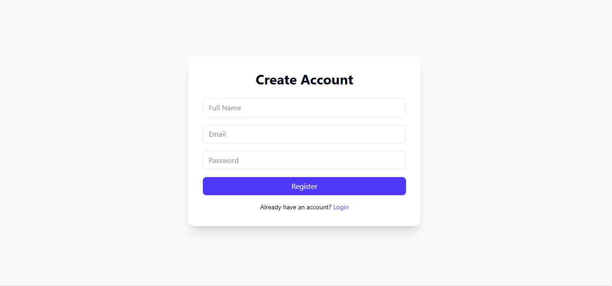
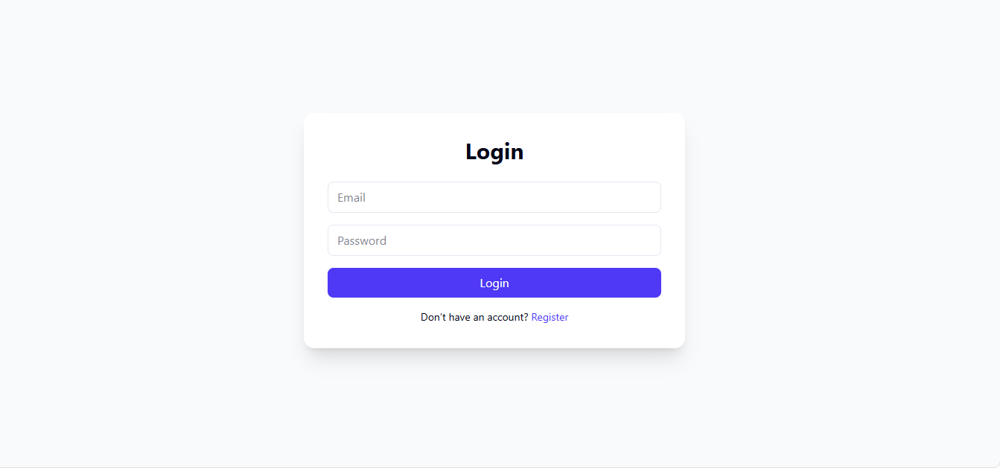
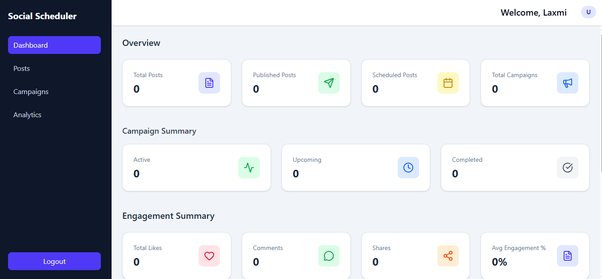
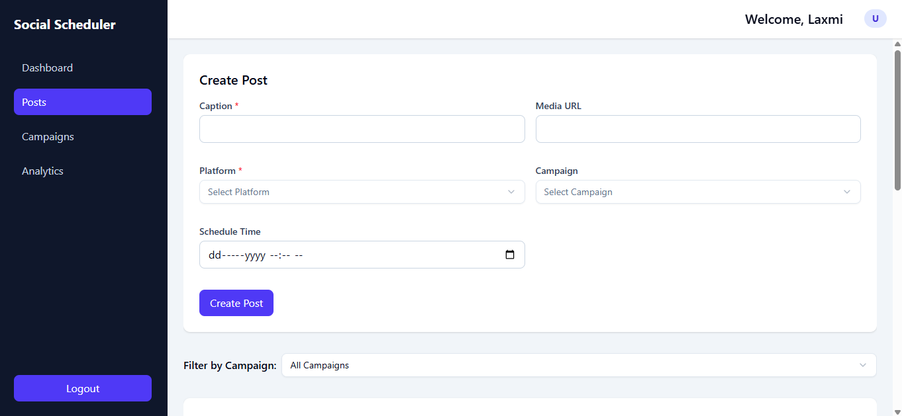
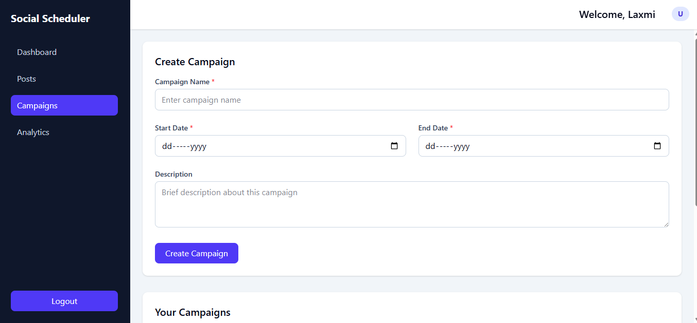
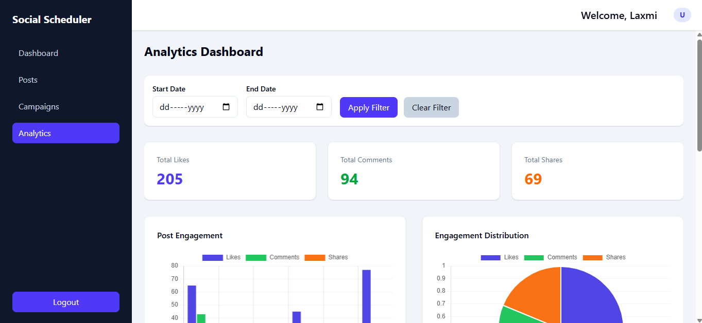
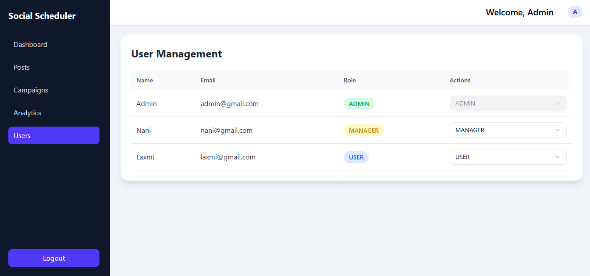

# 🚀 Social Media Scheduler – Frontend


A modern **Social Media Scheduling Dashboard** built with **React + Vite + Tailwind CSS**, enhanced with **shadcn UI components**.

This application allows users to create, schedule, and manage social media posts, organize campaigns, and view engagement analytics — all with role-based access control.

---

## 🚀 Live Demo

🌐 Frontend: https://social-media-schedular-frontend.vercel.app/  
🔗 Backend API: https://social-media-schedular-backend.onrender.com/  

---

# 📸 Screenshots

## 🔐 Authentication



User login and registration functionality with JWT authentication.

## 📊 Dashboard Overview


Shows total posts, campaigns summary, recent activities, and engagement charts.

## 📝 Posts Management (Form View)


Form to create or edit social media posts. List view may be partially cut off.

## 📢 Campaign Management (Form View)


Form to create or edit campaigns. List view may be partially cut off.

## 📈 Analytics Overview (Partial View)


Shows engagement rate, platform-wise performance, and charts (may be partially visible).

## 👥 Users Management (Admin / Manager Only)


Only visible to Admin and Manager. Shows user list and roles.

---

# 📌 Features

## 🔐 Authentication
- User Registration & Login
- JWT Authentication
- Protected Routes
- Role-Based Access (ADMIN / MANAGER)

## 📝 Posts Management
- Create / Edit / Delete Posts
- Schedule Posts (Future validation)
- Platform Selection (Facebook / Instagram)
- Campaign Assignment
- Status Indicators (Scheduled / Published / Draft)
- Restrict Editing Published Posts
- Filter Posts By Campaign
- Auto-refresh every 30 seconds

## 📢 Campaign Management
- Create, Edit, Delete Campaigns
- Date Validation
- Campaign Status (Upcoming / Active / Completed)
- Restrict Editing Completed Campaigns

## 📊 Dashboard Overview
- Total Posts
- Published Posts
- Scheduled Posts
- Campaign Summary
- Engagement Summary
- Recent Activity
- Engagement Charts

## 📈 Analytics
- Bar Chart
- Line Chart
- Pie Chart
- Platform-wise Performance
- Engagement Rate Calculation
- Date Range Filtering

## 👥 Role-Based System
| Role | Access |
|------|--------|
| ADMIN | Full Access |
| MANAGER | Limited Access |
| USER | Restricted Access |

---

# 🛠 Tech Stack

### Frontend
- React 19
- Vite
- Tailwind CSS 4
- Chart.js
- React ChartJS 2
- Day.js
- Axios
- React Router DOM
- Sonner (Toast Notifications)
- Lucide Icons
- Shadcn UI

---

# 📂 Project Structure

```
src/
 ├── components/
 ├── context/
 ├── pages/
 ├── services/
 ├── App.jsx
 └── main.jsx
public/
screenshots/
vite.config.js
package.json
.env

```

---

# ⚙️ Installation & Setup

## 1️⃣ Clone Repository

```bash
git clone https://github.com/Mahalaxmi-Komuravelly/social-media-schedular-frontend
cd social-media-schedular-frontend
```

## 2️⃣ Install Dependencies

```bash
npm install
```

## 3️⃣ Start Development Server

```bash
npm run dev
```

App runs on:

Default base URL:

```
http://localhost:5173
```
For production (deployed backend):

```
https://social-media-schedular-frontend.vercel.app/
```
---

# 🌐 Backend Integration

This frontend connects to a backend API.

Default base URL:

```
http://localhost:8080
```

For production (deployed backend):

```
https://social-media-schedular-backend.onrender.com/
```


Located in:

```
src/services/api.js
```

---

# 🔐 Environment Variables (Recommended)

Create a `.env` file in the root:

## Local development

```
VITE_API_URL=http://localhost:8080
```

## Production (Vercel)
VITE_API_URL=https://social-media-schedular-backend.onrender.com/

Update `api.js`:

```js
baseURL: import.meta.env.VITE_API_URL
```

For production (Vercel), configure the same variable in:

Vercel → Project Settings → Environment Variables

---

# 🏗 Production Build

```bash
npm run build
```

Preview production build:

```bash
npm run preview
```

---

# 🚀 Deployment

You can deploy using:

- Vercel
- Netlify
- Render
- AWS
- Firebase Hosting

Example (Vercel):

```bash
npm install -g vercel
vercel
```

---

# 🧠 Architecture Highlights

- JWT stored in localStorage
- Axios interceptors attach tokens automatically
- Protected & RoleProtected Routes
- Centralized API service
- Responsive mobile-first design
- Auto-refresh mechanism for posts

---

# 🔮 Future Improvements

- Dark Mode
- Drag & Drop Scheduler
- Media Upload Feature
- Pagination
- Search & Filters

---

# 📄 License

MIT License

---

# 👨‍💻 Author

**Mahalaxmi Komuravelly**  
Full Stack Web Developer  
Email: mahalaxmikomuravelly@gmail.com  
GitHub: https://github.com/Mahalaxmi-Komuravelly  

---

⭐ If you found this project helpful, consider giving it a star!